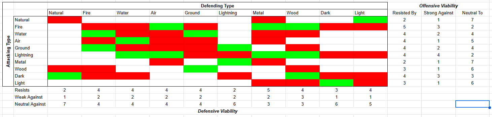

> Deprecated

# Elements

Each `creature` has one or two `elements`. Each `damage` is of a single `element`. Each `element` is either `resistant`, `weak`, or `neutral` to each other `element`. If an `element` is `weak` to the damaging `element`, the `attack` is treated as if it were `enhanced` an extra time. If it were instead `resisted`, the `attack` is treated as if it were `enhanced` one fewer time. If `neutral`, then nothing special happens. `Elements` always `resist` themselves.

# Natural

The base, default `element` that all `creatures` in the natural world embody. Anything they produce with their physicality is typically of the `natural` `element` as well, such as scratches, bashes, bites, and other similar such strikes are `natural`.

- `Resistant`: `wood`
- `Weak`: `dark`

# Fire

The `element` of the plasma state. This `element` produces burns, sets flammable things alight, and manipulates fire.

- `Resistant`: `air`, `wood`, `dark`
- `Weak`: `water`, `ground`

# Water

The `element` of the liquid state. This `element` drenches, pushes, pulls, and douses.

- `Resistant`: `fire`, `ground`, `dark`
- `Weak`: `lightning`, `air`

# Ground

The `element` of the solid state. This `element` slams, cracks, crumbles, and breaks.

- `Resistant`: `lightning`, `fire`, `air`
- `Weak`: `water`, `wood`

# Air

The `element` of the gas state. This `element` lifts, swirls, slashes, and cuts.

- `Resistant`: `ground`, `water`, `metal`
- `Weak`: `lightning`, `fire`

# Metal

The `element` of metallic solids and magnetism. This `element` defends, blocks, spikes, and magnetizes.

- `Resistant`: `water`, `air`, `light`, `natural`
- `Weak`: `fire`, `lightning`

# Lightning

The `element` of electricity. This `element` zaps, shocks, stuns, and electrifies.

- `Resistant`: `dark`
- `Weak`: `ground`, `metal`

# Wood

The `element` of plants and plant growth. This `element` grows, blooms, pollinates, and roots.

- `Resistant`: `water`, `ground`, `light`
- `Weak`: `dark`, `fire`, `lightning`

# Light

The `element` of good. This `element` restores, illuminates, purifies, and smites.

- `Resistant`: `dark`, `fire`, `lightning`
- `Weak`: `natural`

# Dark

The `element` of evil. This `element` consumes, poisons, curses, and rots.

- `Resistant`: `fire`, `lightning`, `light`
- `Weak`: `light`
